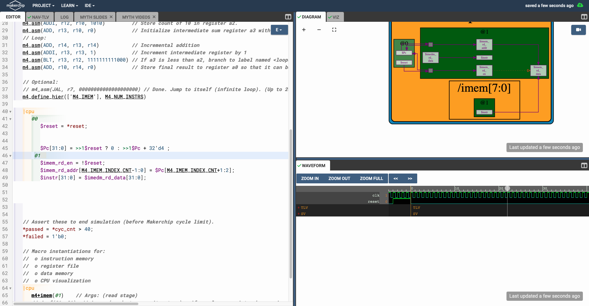
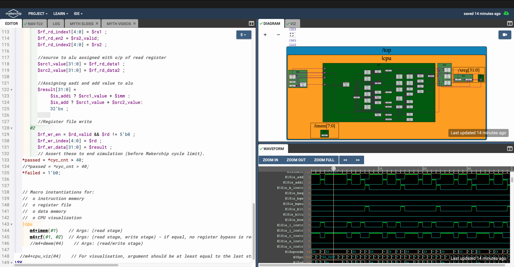
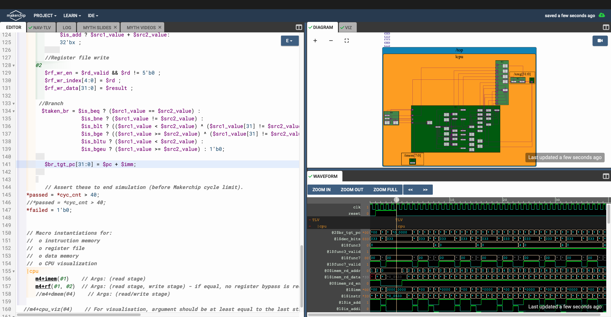

# RISC-V-

DAY 3:

We were trained on transcation level verilog and asked us to implement different logic gates and build a calculator with validty recall and memory.

Calculator logic
Code:

Waveform:

Sequential Logic
Code:

Wvaeform :

Calculator with valdity recall and memory

Code:

Waveform:

Viz:

DAY 4 :

Objective : To implement different components for the pipelining architecture.

Program counter :

Instruction Decode :

Instruction Fetch :

Read/Write :

Branch implementation:

