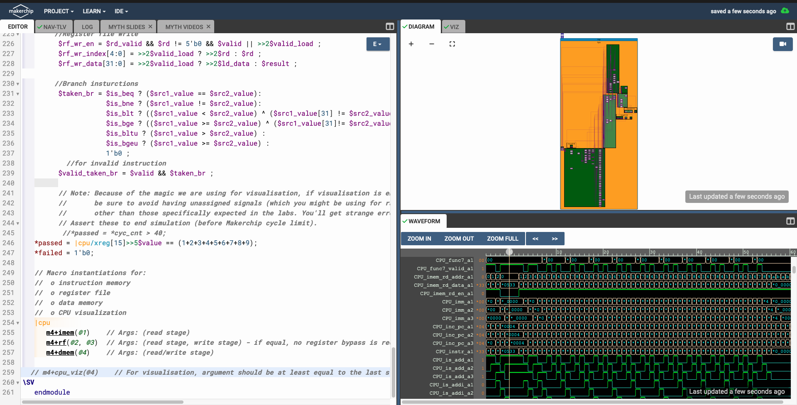

 RISC-V-MYTH-WORKSHOP

DAY 1:
Writing a C CODE for the sum of n integers and compling it and seeing it in assembly language for the RISC V.
CODE:

Assembly Language and Spike output:

We performed the same for signed and unsigned integers.

DAY 2:

We wrote a program in assembly language and complied it using the RISC V architecture and ran it. Further, We converted it HEX code and used it to process trhought the PICORV 32 core.

Assembly Language and Spike output:

RUNNING ON PICROV 32

DAY 3:

We were trained on transcation level verilog and asked us to implement different logic gates and build a calculator with validty recall and memory.

Calculator logic
Code:

Waveform:

Sequential Logic
Code:

Wvaeform :

Calculator with valdity recall and memory

Code:

Waveform:

Viz:

DAY 4 :

Objective : To implement different components for the pipelining architecture.

Program counter :

Instruction Decode :

Instruction Fetch :

Read/Write :

Branch implementation:

DAY 5 : 

Objective : Pipelingn overcoming hazards for the RISC V processor and implement the summing function.

